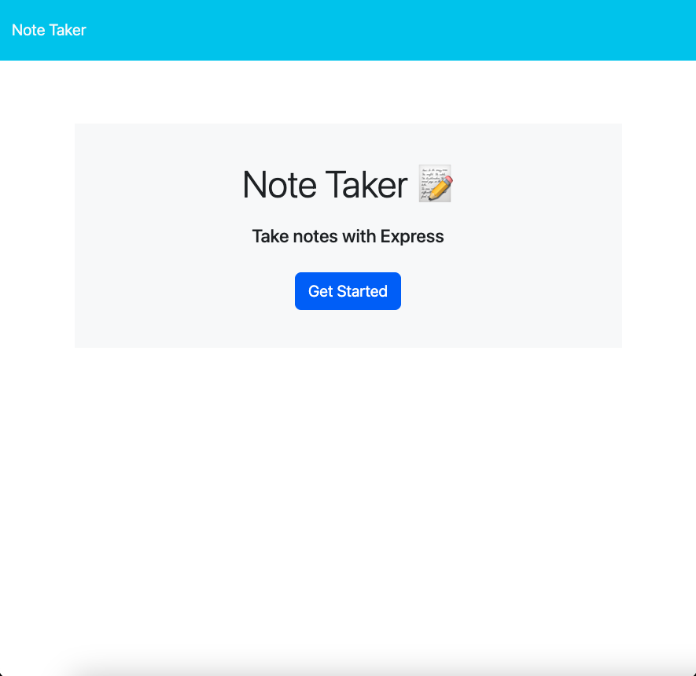
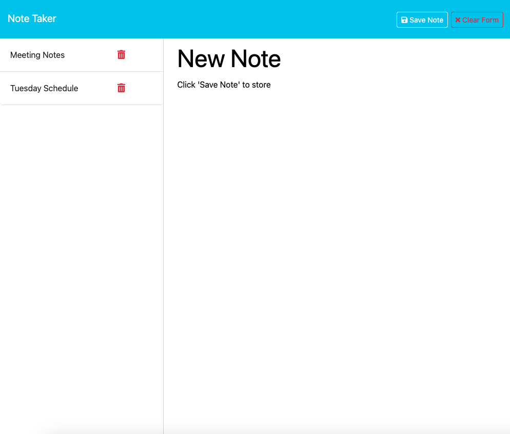

# NoteTakerExpress

## Description
Dynamic note taking application with save, store, and delete capabilities. Built with Express.js.

### Features
* Save, store, and delete notes
* Clear form function
* Simple and easy to use UI

### Packages Used
* Express.js and Node.js
* npm path and fs

### Screenshots

### Links

* Github [Repository](https://github.com/micahives/NoteTakerExpress)
* Deployed application on [Heroku](https://secure-tor-16534-6fffebcdd8bb.herokuapp.com/)